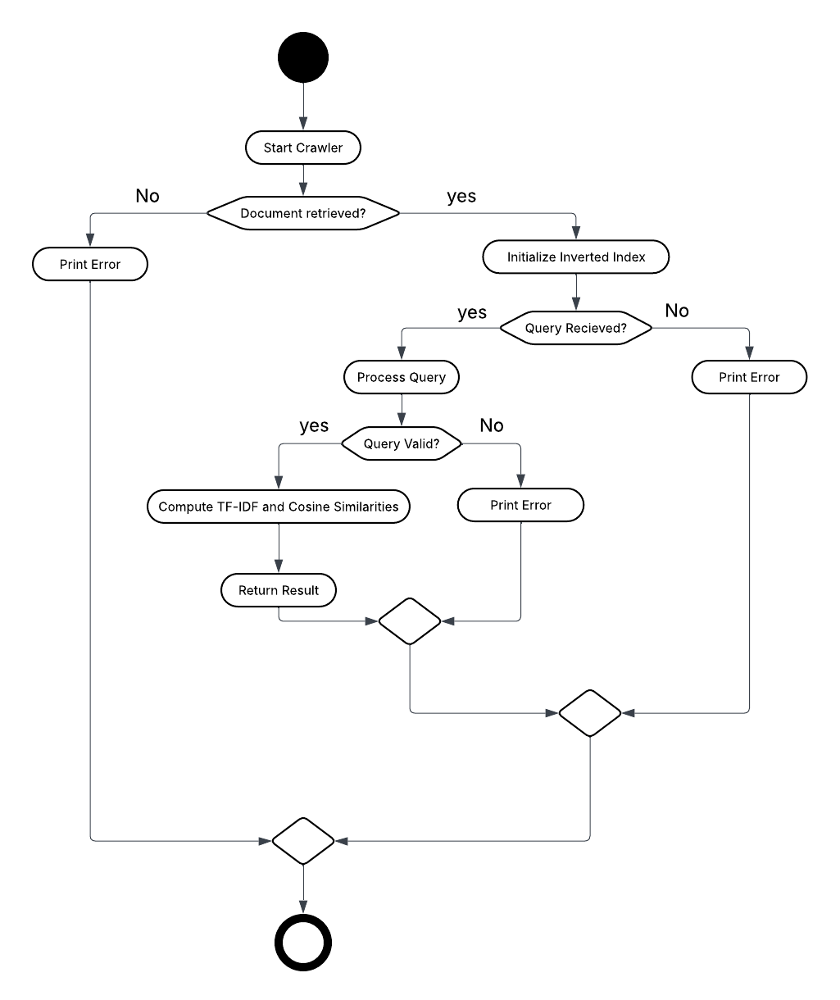

## Abstract

This project focuses on designing and implementing a web-based search pipeline, including document 
acquisition, indexing, and query retrieval. A Scrapy-powered crawler is used to download and store web documents in 
HTML format. An inverted index is then generated using TF-IDF weighting to support efficient similarity-based 
retrieval. Finally, a Flask-driven query processor enables users to submit free-text searches and receive ranked 
document results based on cosine similarity.

Future enhancements can focus on improving scalability and retrieval quality. Optional features such as concurrent 
and distributed crawling using AutoThrottle and Scrapyd would allow faster and broader document collection. Search 
accuracy could be increased by integrating semantic vector embeddings like Word2Vec or FAISS-based k-nearest neighbor 
similarity. Additionally, a front-end search interface and production deployment would make the system more 
user-accessible and robust.

## Overview

This project centers on web document retrieval and query processing. It is built around three key components:  web crawler, an indexer, and a query processor. Together, these components enable efficient crawling, indexing, and searching of web documents.

### Solution Outline

1. **Web Crawler**: Uses Scrapy to crawl the web and download web documents.
2. **Indexer**: Builds an inverted index using TF-IDF and cosine similarity to support search and retrieval.
3. **Query Processor**: Accepts user queries and returns ranked document results using TF-IDF and cosine similarity.

### Relevant Literature: 

- [Scrapy Documentation](https://docs.scrapy.org/en/latest/intro/tutorial.html):  
  This official tutorial provides a comprehensive introduction to Scrapy, a powerful Python framework for web crawling and scraping. It covers spider creation, data extraction, and best practices for scalable web data collection, which directly informs the design of the project's web crawler component.

- [Flask Documentation](https://flask.palletsprojects.com/en/stable):  
  The Flask documentation offers detailed guidance on building lightweight web applications and APIs in Python. It is the primary reference for implementing the query processor and REST API endpoints, enabling user interaction and search result delivery in this project.

For the search indexing section, I have already studied and applied established techniques, as demonstrated in this project.

### Proposed System

The system uses the power of Scrapy for web crawling, Scikit-Learn for TF-IDF indexing and cosine similarity, and Flask for query processing. The combination of these technologies delivers a solution for web document retrieval and query processing.

## Design

Processing user queries involves three integrated components: the Scrapy crawler, which collects web documents; the indexer, which constructs the TF-IDF matrix; and the Flask-based processor, which handles incoming queries. These components interact through structured data exchange and well-defined interfaces to ensure smooth integration across the system.

This activity diagram illustrates the sequence of operations within the system, including crawling, indexing, query processing, and delivering results. Each component works together to support the system’s overall functionality.

## Architecture

The system’s architecture is composed of three core components: the Scrapy crawler, the inverted index generator, and the Flask-based query processor. Together, these components facilitate web document crawling, indexing, and query handling.

This diagram shows how the system’s components interact and communicate using interfaces such as file I/O and HTTP endpoints. The implementation leverages external libraries, including Scikit-Learn, BeautifulSoup, Scrapy, and Flask to provide the necessary functionality for crawling, parsing, indexing, and query processing.

## Operation

**Installation Instructions:**  
  - Ensure Python 3.8 or higher is installed.  
  - Create and activate a virtual environment:  
    - `python -m venv venv`  
    - `venv\Scripts\activate` (Windows) or `source venv/bin/activate` (Linux/Mac)  
  - Install all required dependencies using:  
    - `pip install -r requirements.txt`  

**Software Commands:**  
  - **Running the crawler:** Execute the relevant notebook cells or script to start the Scrapy crawler.  
  - **Building the index:** Run the indexing cells or script to generate the inverted index (`index.json`).  
  - **Running the Flask server and querying:** Start the Flask server by running the appropriate notebook cells or script. Submit queries via the web interface or batch CSV upload.

**Inputs:**  
  - **Seed URL:** The initial URL for the crawler.  
  - **CSV queries:** A CSV file containing `query_id` and `query_text` columns for batch search.  
  - **Configuration options:** Parameters such as maximum pages to crawl, crawl depth, and allowed domains.

**Outputs:**  
  - **Crawled HTML files:** Stored in the `pages/` directory.  
  - **Cleaned text files:** Stored in the `cleaned_text/` directory.  
  - **Inverted index:** Saved as `index.json`.  
  - **Search results:** Ranked results provided as a downloadable CSV file via the Flask API.

## Conclusion

- **Success/Failure:**  
  The project successfully demonstrates the implementation of a modular web search pipeline, encompassing web crawling, document cleaning, inverted indexing, and query processing. The system is capable of acquiring web documents, extracting and cleaning their content, constructing a positional inverted index, and retrieving relevant documents in response to user queries using TF-IDF and cosine similarity. Error handling is incorporated to manage missing files or invalid queries, ensuring robust operation. Potential concerns include network interruptions, website changes, or anti-crawling measures that can disrupt document acquisition, as well as data quality issues or missing files that may affect indexing and search accuracy. Additionally, dependency mismatches, insufficient error handling, or scalability limitations could cause failures in processing or serving queries.

- **Outputs:**  
  The outputs of the system are as follows:  
  - Crawled HTML files are stored in the `pages/` directory.  
  - Cleaned text files are saved in the `cleaned_text/` directory.  
  - The positional inverted index is generated and saved as `index.json`.  
  - Search results for user queries are provided as ranked CSV files, which can be downloaded via the Flask API.  
  - Example outputs, including ranked document results and similarity scores for sample queries, are displayed below as evidence of successful retrieval and ranking.

## Data Sources

- Web documents are sourced from [quotes.toscrape.com](https://quotes.toscrape.com)
- Additional data sources can be integrated as needed for testing and evaluation.

## Test Cases

Test cases focus on verifying the functionality of the crawler, indexer, and query processor. Tools such as Scrapy’s built-in testing utilities and Python’s unit testing frameworks can be used to support this process. Test coverage includes scenarios related to crawling behavior, index generation, and query handling.

## Source Code

The complete source code for this project, including the web crawler, indexer, and query processor, is provided in the accompanying Jupyter notebook (`Crawl_Search.ipynb`) and related Python scripts within the project directory. All implementation details, code cells, and configuration files are included to enable full reproducibility of the results.

Key files and directories:
- `Crawl_Search.ipynb`: Main notebook containing the code for crawling, indexing, and query processing.
- `pages/`: Directory where crawled HTML files are stored.
- `cleaned_text/`: Directory containing cleaned text files extracted from HTML pages.
- `index.json`: Generated inverted index used for search and retrieval.
- `requirements.txt`: List of required Python packages for the project.

To access or modify the source code, open the notebook or scripts in your preferred Python environment (e.g., Jupyter Notebook or Visual Studio Code).

## Bibliography

[1] Scrapy, “Scrapy Tutorial — Scrapy 2.3.0 documentation,” 2012. [Online]. Available: https://docs.scrapy.org/en/latest/intro/tutorial.html

[2] L. Richardson, “Beautiful Soup Documentation — Beautiful Soup 4.4.0 Documentation,” 2015. [Online]. Available: https://beautiful-soup-4.readthedocs.io/en/latest

[3] W3Schools, “Python JSON,” 2025. [Online]. Available: https://www.w3schools.com/python/python_json.asp

[4] Scikit-learn, “sklearn.metrics.pairwise.cosine_similarity,” 2018. [Online]. Available: https://scikit-learn.org/stable/modules/generated/sklearn.metrics.pairwise.cosine_similarity.html

[5] Scikit-learn, “TfidfVectorizer,” 2018. [Online]. Available: https://scikit-learn.org/stable/modules/generated/sklearn.feature_extraction.text.TfidfVectorizer.html

[6] Flask, “Welcome to Flask — Flask Documentation (3.1.x),” 2025. [Online]. Available: https://flask.palletsprojects.com/en/stable

